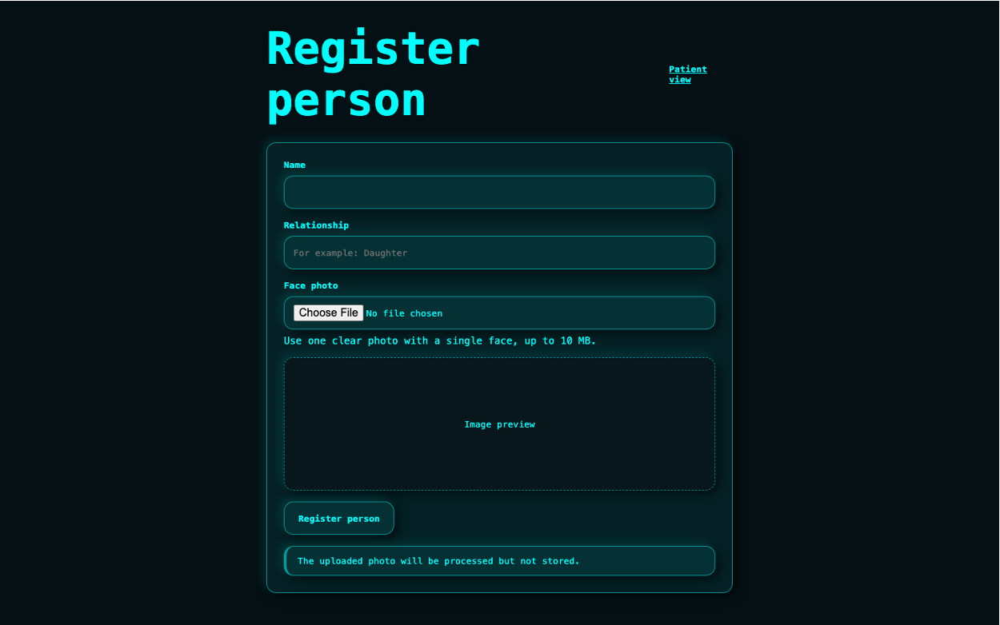

# Remember Me

Remember Me is a hackathon prototype for dementia assistance. It recognizes
registered familiar people through a laptop camera, displays their name and
relationship, and can save an AI-generated summary of a consented conversation
for the next meeting.

## Requirements

- Python 3.11
- [uv](https://docs.astral.sh/uv/)
- Webcam and microphone
- OpenAI API key

## Setup

Install dependencies:

```bash
uv sync
```

Create local configuration:

```bash
cp .env.example .env
```

Set your real key in `.env` without committing or sharing it:

```text
OPENAI_API_KEY=your-key
OPENAI_TRANSCRIPTION_MODEL=gpt-4o-mini-transcribe
OPENAI_SUMMARY_MODEL=gpt-4o-mini
```

## Run

```bash
uv run uvicorn remember_me.main:app --reload --env-file .env
```

Open:

- Patient view: http://127.0.0.1:8000/
- Register a person: http://127.0.0.1:8000/register
- API documentation: http://127.0.0.1:8000/docs
- Health check: http://127.0.0.1:8000/health

Camera and microphone access work on localhost or over HTTPS. DeepFace may
download ArcFace and RetinaFace weights during the first face-processing run.

## Demo Flow

1. Register a familiar person using a clear image containing one face.
2. Open Patient View, start the camera, and wait for recognition.
3. With everyone’s consent, select **Start recording** and have a short
   conversation.
4. Select **Stop recording**. OpenAI transcribes and summarizes the audio.
5. The summary appears immediately and is shown again when that person is next
   recognized.

Recordings stop automatically after two minutes. Face images, webcam frames,
recorded audio, and full transcripts are not stored.

## Test

```bash
uv run python -m pytest
```

Automated tests mock DeepFace and OpenAI calls, so they do not require camera
hardware, upload audio, spend API credits, or expose the API key.

## Privacy

- Record only with the explicit consent of everyone involved.
- OpenAI receives conversation audio and transcript text for processing.
- Only the structured summary is saved in the local SQLite database.
- Face embeddings and conversation summaries are sensitive personal data.
- `.env` and `remember_me.db` are excluded from Git.

# Screenshots from the app



